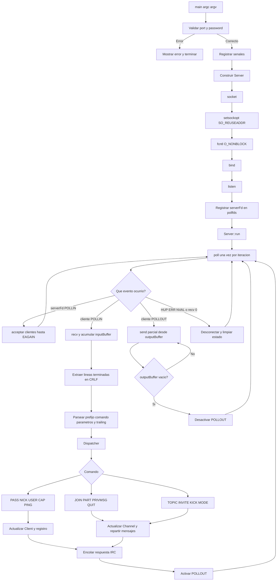
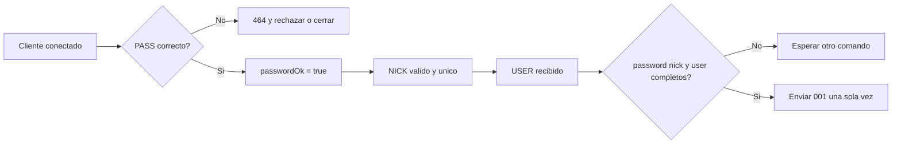

# Mapa de flujo de `ft_irc`

Este documento describe el recorrido que debe seguir una conexion desde que se
inicia el programa hasta que un comando IRC modifica el estado del servidor.
El subject es la autoridad principal; este mapa organiza la implementacion.

## 1. Vista general



La regla principal es que los comandos no llaman directamente a `recv()`,
`send()`, `close()` ni modifican `pollfds`. Los comandos validan y cambian el
estado; el servidor se encarga de encolar respuestas y el bucle de red de
transportarlas.

## 2. Flujo de arranque

```text
main
 |
 +-- comprobar argc == 3
 |
 +-- parsePort(av[1])
 |     +-- texto no vacio
 |     +-- solo digitos ASCII
 |     +-- rango 1..65535
 |
 +-- parsePasswd(av[2])
 |     +-- no vacia
 |     +-- sin caracteres de control
 |
 +-- Server(port, password)
       +-- socket(AF_INET, SOCK_STREAM, 0)
       +-- SO_REUSEADDR
       +-- O_NONBLOCK
       +-- bind()
       +-- listen()
       +-- pollfds = [serverFd, POLLIN]
 |
 +-- server.run()
```

Si falla una validacion o una llamada de red, el programa debe mostrar un
error, cerrar lo que ya haya abierto y terminar con un estado distinto de cero.
La password no debe aparecer en los mensajes de error.

## 3. Bucle principal de red

```text
while (g_running)
    poll(pollfds, timeout)

    para cada descriptor con revents:
        si es serverFd y tiene POLLIN:
            aceptar clientes nuevos

        si es cliente y tiene POLLIN:
            leer bytes
            acumularlos en inputBuffer
            procesar todas las lineas completas

        si es cliente y tiene POLLOUT:
            enviar una parte de outputBuffer
            conservar lo que no se envio

        si tiene POLLHUP, POLLERR o POLLNVAL:
            desconectar y limpiar
```

### Aceptar clientes

`accept()` se repite hasta obtener `EAGAIN` o `EWOULDBLOCK`. Cada nuevo
descriptor debe ser no bloqueante y tener su propio estado:

```text
serverFd
 |
 +-- Client fd 4: inputBuffer, outputBuffer, nick, user, canales
 +-- Client fd 5: inputBuffer, outputBuffer, nick, user, canales
 +-- Client fd 6: inputBuffer, outputBuffer, nick, user, canales
```

### Leer y reconstruir lineas

TCP es un flujo de bytes: una llamada a `recv()` no equivale necesariamente a
una orden IRC. Por eso cada cliente conserva su buffer.

```text
recv(): "PRI"
buffer: "PRI"

recv(): "VMSG #a :hola\\r\\nPING :x\\r\\n"
buffer: "PRIVMSG #a :hola\\r\\nPING :x\\r\\n"

procesar:
    "PRIVMSG #a :hola"
    "PING :x"
```

Los bytes que queden despues de la ultima secuencia `\r\n` permanecen en el
buffer para la siguiente lectura. Se debe aplicar un limite de linea para
evitar que un cliente deje crecer el buffer indefinidamente.

### Escribir sin bloquear

Las respuestas se agregan a `outputBuffer`; no se envian desde el dispatcher.
El bucle activa `POLLOUT` mientras haya datos pendientes. Si `send()` envia
solo una parte, se elimina unicamente esa parte y se conserva el resto.

## 4. Flujo de un comando IRC

```text
bytes TCP
  -> inputBuffer del Client
  -> linea completa CRLF
  -> Message { command, params, trailing }
  -> Dispatcher
  -> Handler del comando
  -> validar registro, parametros y permisos
  -> modificar Server, Client o Channel
  -> construir respuesta con CRLF
  -> outputBuffer de uno o varios clientes
  -> POLLOUT
  -> send()
```

El parser debe conservar los espacios del parametro `trailing`. Por ejemplo,
en `PRIVMSG #general :hola a todos`, el texto del mensaje es `hola a todos`,
no tres parametros separados.

## 5. Registro del cliente



El orden de `PASS`, `NICK` y `USER` puede variar segun el cliente. El servidor
debe guardar el estado parcial en `Client` y comprobar despues de cada comando
si ya puede registrar al usuario.

## 6. Responsabilidades de las clases

```text
Server
 +-- es propietario del listener y de los clientes
 +-- ejecuta poll y acepta conexiones
 +-- busca nicknames y canales
 +-- encola mensajes para clientes
 +-- elimina clientes y canales vacios

Client
 +-- fd y buffers de entrada/salida
 +-- passwordOk y registered
 +-- nickname, username y realname
 +-- relacion con los canales

Channel
 +-- nombre y topic
 +-- miembros y operadores
 +-- invitados
 +-- modos i, t, k, o y l
 +-- broadcast a sus miembros

Parser / Message
 +-- convierte bytes completos en una orden estructurada

Dispatcher / Commands
 +-- selecciona el handler
 +-- valida precondiciones
 +-- cambia estado
 +-- solicita respuestas, sin tocar sockets
```

## 7. Orden recomendado de implementacion

Cada paso debe compilar antes de comenzar el siguiente.

```text
1. main: argumentos y senales
2. Server: socket, bind, listen y cierre
3. poll: aceptar varios clientes
4. Client: recv, buffers y desconexion
5. outputBuffer: send parcial y POLLOUT
6. Parser: CRLF, fragmentos y trailing
7. Dispatcher: CAP y PING/PONG
8. Registro: PASS, NICK, USER y 001
9. Channel: JOIN, PART y QUIT
10. PRIVMSG a nick y canal
11. TOPIC e INVITE
12. KICK
13. MODE: i, t, k, o y l
14. pruebas de errores y limpieza
```

## 8. Comprobacion minima por fase

| Fase | Prueba que debe pasar |
| --- | --- |
| Arranque | `./ircserv 6667 secret` abre el puerto y `Ctrl-C` termina limpio |
| Transporte | Dos clientes con `nc` permanecen conectados sin bloquearse |
| Buffers | Una orden dividida en varios envios se reconstruye correctamente |
| Varias lineas | Dos ordenes en un envio se procesan por separado |
| Registro | `PASS`, `NICK`, `USER` produce un unico `001` |
| Nickname | Un nick duplicado recibe `433` |
| Canal | Dos clientes hacen `JOIN` y reciben el mensaje correspondiente |
| Mensaje | `PRIVMSG` llega al destino correcto y no al emisor incorrecto |
| Permisos | `+i`, `+k`, `+l` y `+t` rechazan casos no autorizados |
| Limpieza | `PART`, `QUIT` y cierre abrupto eliminan membresias |

Compilar no demuestra por si solo que el servidor cumple el subject. Tambien
hay que revisar que exista una sola llamada a `poll()` por iteracion, que no se
usen `fork()`, threads ni `select()`, y que ninguna ruta de comando bloquee.